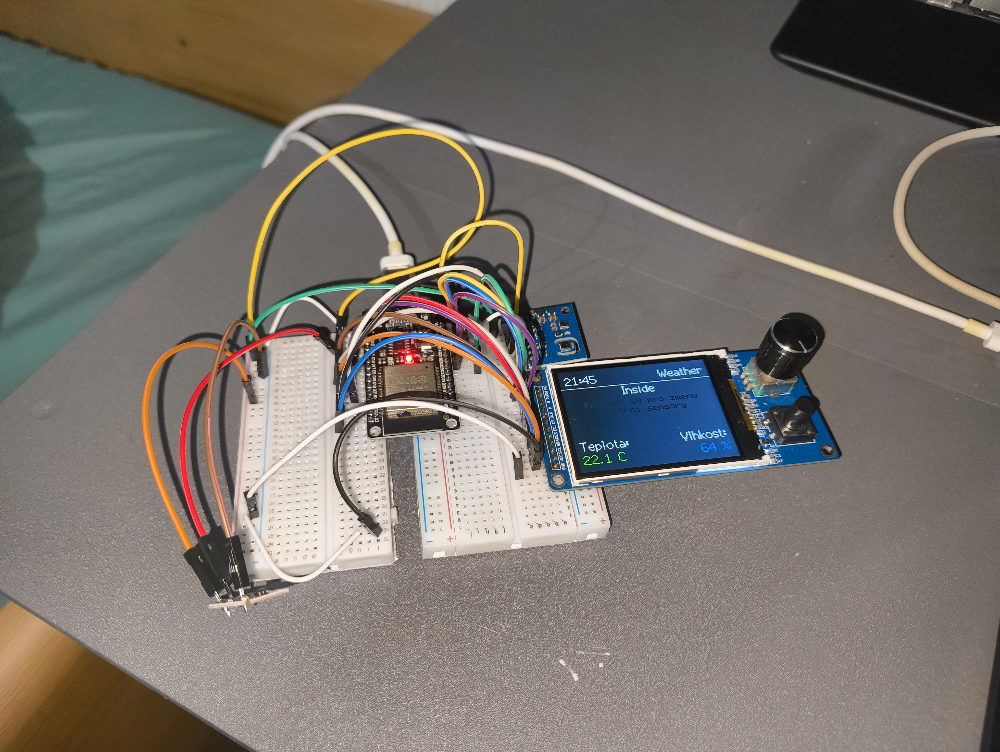

# Node Smart Clock

**Node Smart Clock** is an open-source, multi-functional desk clock powered by the **ESP32-WROOM-32D-N4**. It is designed as a central hub for makers, entrepreneurs, and crypto enthusiasts, combining advanced environmental sensing with real-time data tracking.

---

## Key Features

- **Environmental Monitoring:** Track CO2 levels, Air Quality (ENS160), and temperature in real-time.
- **Business & Crypto Tracker:** Live tracking for cryptocurrency prices, social media follower counts, and Shopify order notifications.
- **Smart Display:** 2.8" TFT display with **automatic brightness adjustment** based on ambient light (GY-302) to save battery.
- **Visual Notifications:** An array of **8 individually addressable LEDs** on top for animations, progress bars, and alerts.
- **Precise Timekeeping:** Dedicated **PCF8563T RTC chip** with a coin-cell backup, ensuring your alarms work even if the main power is lost.
- **Energy Efficient:** Optimized for **Deep Sleep** with a side-mounted **touch sensor** for intuitive wake/sleep control.

## Design & Construction

The project blends modern electronics with premium natural materials:

- [**3D Printed Chassis:**](https://github.com/martinsram3k/Node-Smart-Clock/tree/main/3d_models/stl) A minimalist housing designed for durability using **brass heat inserts**.
- **Hybrid Materials:** Front and back panels made of **real wood**, suitable for custom laser engraving.
- [**Custom PCB:** ](https://github.com/martinsram3k/Node-Smart-Clock/tree/main/pcb/esp_smart_clock)A professional-grade board integrating the ESP32-S3, 18650 battery charging.

## Hardware (BOM)

| Designator | LCSC #    | Value / Description           | Qty | Unit Price | Ext. Price | Note                     |
| ---------- | --------- | ----------------------------- | --- | ---------- | ---------- | ------------------------ |
| U1         | C473012   | ESP32-WROOM-32D-N4            | 1   | $3.78790   | $3.78790   | Main MCU                 |
| U4         | C15255    | PCF8563T (RTC)                | 1   | $0.32000   | $0.32000   | Not in export, estimated |
| U5         | C6186     | AMS1117-3.3 (LDO)             | 5   | $0.17350   | $0.86750   | Voltage regulator        |
| U6         | C16581    | TP4056 (Charger)              | 5   | $0.17840   | $0.89200   | Battery charging         |
| D1-D8      | C22461793 | WS2812B (RGB LED)             | 8   | $0.03840   | $0.30720   | Addressable LEDs         |
| D10-D12    | C2128     | 1N4148WS (Diode)              | 4   | $0.02100   | $0.08400   | Power OR Logic           |
| Q1-Q4      | C318884   | S8050 (Transistor)            | 10  | $0.01250   | $0.12500   | Reset/Motor/Buzzer       |
| J1         | C2927039  | USB-C 16-pin                  | 1   | $0.23190   | $0.23190   | Power/Data               |
| BT1        | C70381    | Battery Holder CR1220         | 1   | $0.13840   | $0.13840   | RTC Backup               |
| C1, C2, C6 | C1525     | 100nF (0402)                  | 100 | $0.00130   | $0.13000   | Minimal order is 100pcs  |
| C3, C4, C5 | C13585    | 10uF (1206)                   | 10  | $0.02700   | $0.27000   | Power decoupling         |
| x          | x         | 2.4 Inch TFT Display          | 1   | $5.90000   | $5.90000   | Display                  |
| x          | x         | H7BC ENS160+AHT21             | 1   | $7.95000   | $7.95000   | Temp and co2 sensor      |
| x          | x         | TTP223                        | 1   | $0.07000   | $0.07000   | Touch sensor             |
| x          | x         | BH1750                        | 1   | $2.49000   | $2.49000   | Ambient light sensor     |
| x          | x         | Brass Copper Embed Insert Nut | 8   | $0.04000   | $0.32000   | M3xL4xOD4.2              |

## Gallery

</img>
</img>
</img>
</img>
</img>
<a href="img/IMG_20260118_214504446.jpg" target="_blank" ></img></a>

## Software & Development

This project is fully **Open-Source**.

- **Framework:** Arduino IDE / PlatformIO.
- **Graphics:** Driven by the **LVGL** library for a smooth UI experience.
- **Connectivity:** Integrated WiFi for NTP time sync and API data fetching.

---

## Support the Project

If you like the **Node Smart Clock**, there are several ways you can support the development:

<!-- * **MakerWorld Crowdfunding:** Support our campaign to help us scale PCB production and DIY kits! -->

- **Buy Me a Coffee:** Support my work directly at [buymeacoffee.com/martin.sram3k](https://buymeacoffee.com/martin.sram3k).
- **Follow My Journey:** Check out all my projects and social media via my [Linktree](https://linktr.ee/martin.sram3k).

Your backing helps us continue developing new open-source features and high-quality hardware for the community.

---

**License:** MIT – Feel free to share, modify, and build!
